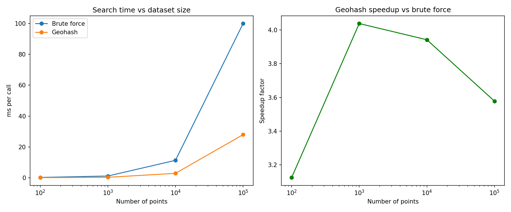

# ice-autoATES

Automated [Avalanche Terrain Exposure Scale (ATES)](https://www.avalanche.ca/mountain-information/ates) classification for Canadian mountain terrain. Upload a GPX route to see exposure ratings along your track, or browse pre-classified areas on an interactive map.

---

## Quick Start

```bash
git clone https://github.com/jacKlinc/ice-autoATES.git
cd ice-autoATES
uv sync
uv run streamlit run app.py
```

Requires [uv](https://docs.astral.sh/uv/getting-started/installation/).

---

## Features

- **Route Analysis** — Upload a GPX file to sample ATES class at each track point, view a colour-coded map and elevation profile, and get a wet avalanche advisory
- **Area Map** — Browse pre-classified terrain with contour overlays fetched live from the [NRCan CDEM](https://open.canada.ca/data/en/dataset/7f245e4d-76c2-4caa-951a-45d1d2051333)

---

## Adding a New Area

1. Create `data/areas/<name>/metadata.json`:
```json
{
  "name": "My Area",
  "lat": 51.23,
  "lon": -116.45,
  "zoom": 13,
  "description": ""
}
```

2. Generate the ATES classification raster:
```bash
uv run python scripts/generate_ates_tif.py <name>
```

---

## Development

```bash
uv sync --group dev
uv run --group dev pytest --cov=ates
```
### Installing GDAL

On Ubuntu:
```bash
sudo apt-get install gdal-bin libgdal-dev
```
Then install the Python bindings pinned to match the system version:
```bash
gdal-config --version  # e.g. 3.8.4
uv add gdal==3.8.4
```
---

## Project Structure

```
ice-autoATES/
├── app.py              # Streamlit entry point
├── ates/               # Core library (areas, DEM, GPX, sampling)
├── pages/              # Streamlit pages (Route Analysis, Area Map)
├── scripts/            # CLI utilities (generate_ates_tif.py)
├── tests/              # Pytest test suite
├── data/
│   ├── areas/          # Pre-classified areas (metadata + ates_gen.tif)
│   ├── gpx/            # Example GPX tracks
│   └── polar-circus/   # Research DEM (Polar Circus, Icefields Pkwy)
├── notebooks/          # Exploratory analysis
└── docs/               # Glossary, benchmark plan
```

---

## Geohashing

Geohashing offers more performant geospatial searching. Even with a rudimentary search algorithm the performance is **3-4x faster than the typical Haversine distance.** The performance gains seem to drop off at bigger dataset sizes due to an unoptimised search algorithm (~O(n)) when it should really be constant time (O(1)).




See [notebook](notebooks/geohashing.ipynb) for more.

---

## References

- Vors et al. (2024). *AutoATES v2.0.* [NHESS](https://nhess.copernicus.org/articles/24/1779/2024/nhess-24-1779-2024.html)
- AutoATES v2 source: [github.com/AutoATES/AutoATES-v2.0](https://github.com/AutoATES/AutoATES-v2.0)
- CAA (2016). *Avalanche Terrain Exposure Scale: Implementation Guidelines.*
