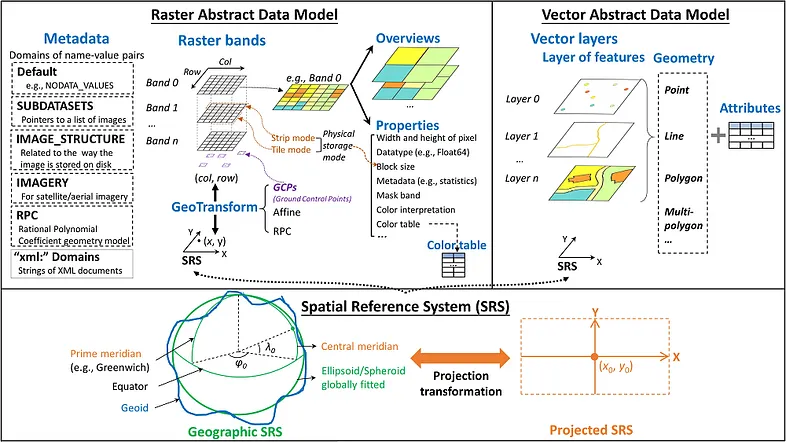

# Glossary

Here's a glossary of terms relevant to working with DEMs and geospatial rasters:

### Raster & Data Structure

**Raster is vaster, but vector is corrector**

- **Raster**: can store a lot of data about a certain area. Best for **continuous** data.
- **Vector**: alternate option to raster. Can be a point, line or polygon. Pro: does not lose resolution when zooming out. Best for **discrete** data. Not great for elevation data.
- Band
- Resolution / spatial resolution
- Pixel / cell
- Extent / bounding box
- NoData value
- Coordinate Systems

### CRS (Coordinate Reference System)
- Projected CRS vs Geographic CRS
- EPSG code
- Affine transform
- Origin (top-left corner)

### Raster Orientation
- North-up
- Pixel size (positive vs negative)
- Row-major order
  
### Elevation / Terrain
- **DEM** (Digital Elevation Model): generic digital model of the bare earth's elevation 
- **DTM** (Digital Terrain Model): 3D contour map that excludes non-land items
- **DSM** (Digital Surface Model): DTM but with non-land items like trees and buildings
- Hillshade
- Slope
- Aspect
- Gradient

### File Formats
- GeoTIFF
- COG (Cloud Optimized GeoTIFF)
- CRS metadata in TIFF

### Tools/Libraries
- **GDAL**: relate geography to computer data structure 
- **rasterio**: library for reading and writing raster data
- pyproj
- affine (Python library) 

